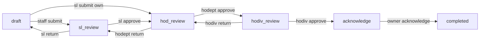
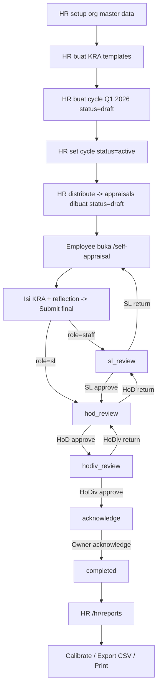

# User Flow — HRIS KPI / Performa

Dokumen ini menjelaskan alur aplikasi end-to-end berdasarkan kode FE ([hris-kpi-fe](../../hris-kpi-fe/)) dan BE ([hris-kpi-be](../../hris-kpi-be/)) yang sedang berjalan.

Stack:
- FE: React 18 + TypeScript, Vite, TanStack Router/Query/Form/Table, Tailwind 3.
- BE: Hono + Drizzle ORM + Postgres + Zod + JWT (jose, HS256, expiry 8 jam).

---

## 1. Aktor & Role

Field `role` di tabel [users](../../hris-kpi-be/src/db/schema.ts) — enum `UserRole` di [src/types.ts](../../hris-kpi-be/src/types.ts):

| Role | Akses utama |
|---|---|
| `staff` | Self appraisal, dashboard, history, account. |
| `sl` | Self appraisal + review subordinate (Squad Leader). |
| `hodept` | Review HoD level (Head of Department). |
| `hodiv` | Review HoDiv level (Head of Division). |
| `hr` | Full akses HR (org master data, KRA templates, cycles, distribusi, reports, calibration). |

Catatan dari `selfAppraisalRoute` di [router.tsx](../../hris-kpi-fe/src/app/router.tsx):
- Hanya `staff` dan `sl` yang bisa buka `/self-appraisal`. `hodept` dan `hodiv` tidak punya self appraisal.
- `sl` saat submit self appraisal akan langsung lompat ke `hod_review` (lihat `advanceStatusFor` di [domain/appraisal.ts](../../hris-kpi-be/src/domain/appraisal.ts:16)).

---

## 2. Status Machine Appraisal

Forward order (sumber tunggal: [domain/appraisal.ts](../../hris-kpi-be/src/domain/appraisal.ts:3)):

```
draft → sl_review → hod_review → hodiv_review → acknowledge → completed
```

Aturan transisi:
- `advanceStatusFor(status, role)` — naikkan status. SL submit dari `draft` lompat langsung ke `hod_review` (skip self-review by SL).
- `returnTargetFor(role)` — kickback target reviewer:
  - `sl` → `draft`
  - `hodept` → `sl_review`
  - `hodiv` → `hod_review`
- `requiredRoleForApproval(status)` — siapa yang boleh approve di status itu:
  - `sl_review` → `sl`
  - `hod_review` → `hodept`
  - `hodiv_review` → `hodiv`

Mermaid flow:



---

## 3. Auth Flow

Public routes: `/login`, `/forgot-password`.

Login flow:
1. User buka `/login` → `LoginPage` ([features/auth/pages/login](../../hris-kpi-fe/src/features/auth/pages/login.tsx)).
2. POST `/auth/login` (BE: [app.ts:84](../../hris-kpi-be/src/app.ts)) — bcrypt compare password.
3. BE return `{ token, user }`. Token JWT HS256 expiry 8 jam ([http/auth.ts](../../hris-kpi-be/src/http/auth.ts)).
4. FE simpan token di `localStorage[hris_auth_token]`, user di `localStorage[hris_auth]`. Auto-attach `Authorization: Bearer …` via `shared/api/client.ts`.
5. Index `/` redirect: `hr` → `/hr/dashboard`, role lain → `/dashboard`, unauth → `/login` ([router.tsx:187](../../hris-kpi-fe/src/app/router.tsx)).

Logout: `POST /auth/logout` (no-op server side) + clear localStorage.

---

## 4. HR Setup (Sekali per Cycle)

### 4.1 Master Data Organisasi

Menu: `Organization` (`/hr/organization`).

CRUD endpoints di [app.ts:322-397](../../hris-kpi-be/src/app.ts) (helper `crud()`):
- `/org/divisions`
- `/org/departments`
- `/org/positions`
- `/org/employees` — termasuk field `reviewerSl`, `reviewerHod`, `reviewerHodiv`, `manager`, `squad`, `divId`, `deptId`.
- `/org/job-titles`
- `/org/squads`

HR pastikan tiap employee aktif punya:
- `divId`, `deptId`, `position` valid.
- `manager` (nama SL) → dipakai matching reviewer SL saat distribusi.
- `reviewerHod`, `reviewerHodiv` opsional (default ditarik dari `department.headId` dan `division.headId`).

### 4.2 KRA Templates

Menu: `KRA Templates` (`/hr/kra-templates`).

Template terikat ke `deptId` + `name`. Distribusi mencari template via:
```
template.deptId === employee.deptId
&& employee.position.toLowerCase().includes(template.name.toLowerCase())
```
([app.ts:435-439](../../hris-kpi-be/src/app.ts)).

HR isi:
- Nama template (harus jadi substring `position` employee target).
- Daftar `kraTemplateItems`: `title`, `kpi`, `weight`. Total weight diharapkan `100`.

### 4.3 Cycle Lifecycle

Menu: `Cycles` (`/hr/cycles`).

Status cycle: `draft | active | closed`.

Field cycle (lihat `cycles` schema):
- `name` (mis. `Q1 2026 Appraisal`)
- `startDate`, `endDate`
- `selfDeadline` (opsional)
- `status`
- `description`
- Counters: `totalAppraisals`, `completed`, `inReview`, `draft` (di-recalc setelah distribusi).

HR jalan:
1. Buat cycle dengan `status=draft`.
2. Set ke `active` saat siap distribusi.
3. Buka detail cycle (`/hr/cycles/$cycleId`) untuk preview distribusi & klik distribute.

### 4.4 Distribusi Appraisal

Menu: `Cycle Detail` (`/hr/cycles/$cycleId`).

Endpoint:
- `GET /cycles/:id/distribution` — preview, return per-employee status.
- `POST /cycles/:id/distribute` — actual create. Cycle harus `status=active` ([app.ts:500](../../hris-kpi-be/src/app.ts)).

Per employee, sistem klasifikasi:
- `skipped_already` — sudah punya appraisal di cycle yang sama.
- `skipped_no_template` — tidak ada template match `deptId + position`.
- `skipped_no_reviewer` — `hod` atau `hodiv` tidak ditemukan.
- `matched` — siap dibuat.

Saat distribute (matched only), BE create row `appraisals`:
- `userId`, `cycleName`, `cycleShort`
- `status='draft'`, `reflection=''`
- Snapshot reviewer (auto-assign saat distribusi):
  - `reviewerSlUserId/Name/Initials` (fallback ke HoD jika SL kosong)
  - `reviewerHodUserId/Name/Initials`
  - `reviewerHodivUserId/Name/Initials`
- Copy template items ke tabel `kras` (1:1, `selfScore=0`, `selfComment=''`, `sortOrder` urut).

Snapshot reviewer dipakai sepanjang cycle — perubahan struktur org setelah distribusi tidak mempengaruhi appraisal yang sudah dibuat.

---

## 5. Employee Self Appraisal

Route: `/self-appraisal` ([SelfAppraisalPage](../../hris-kpi-fe/src/features/appraisal/pages/self-appraisal.tsx)).

Akses: `staff` atau `sl` (lihat [router.tsx:84-88](../../hris-kpi-fe/src/app/router.tsx)).

Flow:
1. Page load → `useMyAppraisals(user.id)` → `GET /appraisals/user/:userId`. Ambil appraisal pertama (sortir: yang belum `completed` di atas).
2. Editable hanya saat `status === 'draft'`.
3. Per KRA, employee isi:
   - `self_score` (1–5, ScorePicker)
   - `self_comment`
   - `evidence[]` (file upload via `/uploads` atau URL)
4. Tab `Employee reflection` — tulis ringkasan cycle.
5. **Save draft** — `PATCH /appraisals/:id` body `{ kras, reflection }`. Status tetap `draft`.
6. **Submit final** — sama seperti save draft, lalu `POST /appraisals/:id/advance`. Hanya `userId === actor.id` yang boleh submit dari `draft` ([app.ts:174](../../hris-kpi-be/src/app.ts)).

Submit gate (di FE):
- Semua KRA punya `self_score > 0`.
- Reflection terisi.
- Total weight KRA = 100% (info-only, tidak block submit di FE saat ini).

Side-effects setelah submit final:
- `submittedAt` terisi `now()`.
- Append `auditEntries` action `submit`, `fromStatus=draft`, `toStatus=`:
  - `sl_review` jika role `staff`.
  - `hod_review` jika role `sl` (skip SL self-review).
- Kembali ke `/dashboard`.

Return note (kickback):
- Jika appraisal sebelumnya pernah `return`, banner kuning muncul dengan reason + actor + timestamp (helper `lastReturnEntry` di [shared/lib/types/appraisal](../../hris-kpi-fe/src/shared/lib/types/appraisal.ts)).

---

## 6. Review Berjenjang (Team Reviews)

Reviewer dapat queue via `GET /reviews/queue?reviewerUserId=…&role=…`. Filter di BE ([app.ts:265-288](../../hris-kpi-be/src/app.ts)):
- `role=sl` → `reviewerSlUserId === userId && status==='sl_review'`
- `role=hod` → `reviewerHodUserId === userId && status==='hod_review'`
- `role=hodiv` → `reviewerHodivUserId === userId && status==='hodiv_review'`

Setiap reviewer punya page sendiri:

| Role | Route | Page |
|---|---|---|
| SL | `/review/sl/$appraisalId` | [review-sl.tsx](../../hris-kpi-fe/src/features/review/pages/review-sl.tsx) |
| HoD | `/review/hod/$appraisalId` | [review-hod.tsx](../../hris-kpi-fe/src/features/review/pages/review-hod.tsx) |
| HoDiv | `/review/hodiv/$appraisalId` | [review-hodiv.tsx](../../hris-kpi-fe/src/features/review/pages/review-hodiv.tsx) |

`hr` boleh akses semua review page (untuk override/inspect). Lihat `beforeLoad` masing-masing route.

Per page reviewer isi:
- `sl_score / sl_comment` atau `hod_score / hod_comment` atau `hodiv_score / hodiv_comment` per KRA.
- Feedback notes opsional.

Action tersedia:
1. **Save progress** → `PATCH /appraisals/:id` (status tidak berubah).
2. **Approve** → `POST /appraisals/:id/advance`. Validasi BE: `actor.role === requiredRoleForApproval(status)`. Append audit `action='approve'`.
3. **Return** → `POST /appraisals/:id/return` body `{ reason }`. Validasi BE: actor role harus match required role status sekarang. Status di-set ke `returnTargetFor(actorRole)`. Append audit `action='return'`.

State transition setelah approve:
- SL approve `sl_review` → `hod_review`.
- HoD approve `hod_review` → `hodiv_review`.
- HoDiv approve `hodiv_review` → `acknowledge`.

---

## 7. Acknowledge oleh Employee

Setelah HoDiv approve, status → `acknowledge`. Employee terima notif (via dashboard) untuk buka:

Route: `/acknowledge/$appraisalId` → [AcknowledgePage](../../hris-kpi-fe/src/features/appraisal/pages/acknowledge.tsx).

Halaman menampilkan:
- Score comparison (self vs SL vs HoD vs HoDiv) per KRA.
- Final score = `Σ (hodiv_score ?? hod_score ?? sl_score ?? self_score) × (weight/100)`.
- Audit timeline lengkap.

Gate acknowledge ([app.ts:241-263](../../hris-kpi-be/src/app.ts)):
- `appraisal.status` harus `acknowledge`.
- `actor.id === appraisal.userId` (hanya owner).

Click `Acknowledge` → `POST /appraisals/:id/acknowledge`:
- BE update `status='completed'`, `acknowledgedAt=now()`.
- Append audit `action='acknowledge'`, `fromStatus='acknowledge'`, `toStatus='completed'`.
- FE redirect ke `/dashboard`.

---

## 8. HR Reports & Calibration

Route: `/hr/reports` → [HrReportsPage](../../hris-kpi-fe/src/features/reports/pages/hr-reports.tsx).

Filter: per cycle, lalu sub-filter `all | pending | calibrated`.

Fitur:
- **Bell curve** — distribusi `effectiveScore = calibratedScore ?? finalScore`.
- **Tabel appraisal** completed.
- **Calibration modal** — HR isi `calibratedScore` dan `finalGrade`. Save → `is_calibrated=true`.
- **Export CSV** — kolom: `Employee ID, Name, Department, Job Title, Cycle, Original Final Score, Calibrated Score, Final Grade, Calibration Status`.
- **Print view** detail report per appraisal.

Calibration tidak wajib — appraisal `completed` sudah masuk report begitu employee acknowledge.

---

## 9. Dashboard

### 9.1 Employee Dashboard (`/dashboard`)

Untuk role non-HR. Menampilkan:
- Appraisal aktif user (status, deadline, progress).
- Action card jika ada `acknowledge` pending → CTA ke `/acknowledge/:id`.
- Untuk `sl/hodept/hodiv`: queue review yang assigned.
- Quick links ke history & account.

### 9.2 HR Dashboard (`/hr/dashboard`)

BE-aggregated stats: total cycle, total appraisal per status, distribution coverage, kalibrasi pending, dst.

---

## 10. History & Account

- `/history-appraisal` — semua role. Tampilkan appraisal completed milik user via `GET /appraisals/user/:userId` filter `status='completed'`.
- `/my-account` — profile + change password (jika tersedia di endpoint).

---

## 11. Audit Trail

Tabel `auditEntries` ([db/schema.ts](../../hris-kpi-be/src/db/schema.ts)). Setiap transisi append row:
- `appraisalId`, `timestamp`, `actorUserId`, `actorName`, `actorRole`
- `action`: `submit | approve | return | acknowledge`
- `fromStatus`, `toStatus`
- `reason` (hanya untuk `return`)

Render di FE via `AuditTimeline` ([shared/domain/audit-timeline](../../hris-kpi-fe/src/shared/domain/audit-timeline.tsx)) — muncul di self-appraisal, review pages, acknowledge page, dan report detail.

---

## 12. Skenario End-to-End (Q1 2026)



---

## 13. Endpoint Map (Quick Reference)

| Endpoint | Method | Auth | Caller |
|---|---|---|---|
| `/auth/login` | POST | public | LoginPage |
| `/auth/me` | GET | bearer | AuthProvider bootstrap |
| `/auth/demo-users` | GET | public | LoginPage demo picker |
| `/appraisals/user/:userId` | GET | bearer | dashboard, self-appraisal, history |
| `/appraisals/history?userIds=` | GET | bearer | HR dashboard subordinate roll-up |
| `/appraisals/:id` | GET | bearer | review pages, acknowledge |
| `/appraisals/:id` | PATCH | bearer | save draft kras + reflection |
| `/appraisals/:id/advance` | POST | bearer | submit / approve |
| `/appraisals/:id/return` | POST | bearer | reviewer kickback |
| `/appraisals/:id/acknowledge` | POST | bearer (owner) | acknowledge page |
| `/reviews/queue` | GET | bearer | dashboard review queue |
| `/org/*` | CRUD | bearer | HR organization page |
| `/cycles` | CRUD | bearer | HR cycles page |
| `/cycles/:id/distribution` | GET | bearer | cycle detail preview |
| `/cycles/:id/distribute` | POST | bearer | cycle detail action |
| `/kra-templates*` | CRUD | bearer | HR KRA templates |
| `/reports/*` | GET / POST | bearer | HR reports + calibration |
| `/dashboard/*` | GET | bearer | dashboards |
| `/uploads/*` | GET / POST | bearer | evidence upload + serve |

---

## 14. Catatan Implementasi

- Naming response field: appraisal & audit pakai `snake_case` (kontrak FE lama). Endpoint lain `camelCase`.
- Semua ID = `serial integer`.
- Error pattern: `fail(status, msg)` → throw `HttpError` → `app.onError` → JSON.
- Validasi input: Zod di tiap handler.
- Snapshot reviewer dibuat saat distribusi — bukan live-read tiap review.
- `sl` self-appraisal otomatis skip SL step (lompat ke `hod_review`) — diatur di `advanceStatusFor`, bukan di FE.
- Acknowledge step **wajib** untuk transisi `hodiv_review → completed`. Tidak ada bypass.
- Calibration tidak block status — appraisal `completed` tetap muncul di report tanpa kalibrasi.
