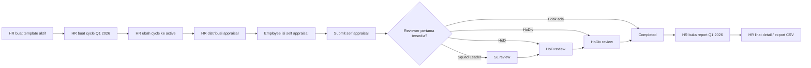

# User Flow Appraisal Q1 2026

Dokumen ini menjelaskan alur appraisal yang berlaku di aplikasi saat ini untuk skenario `Q1 2026`, mulai dari setup HR, distribusi form, self appraisal, review berjenjang, sampai HR calibration dan report.

## Perubahan Terakhir

- Template appraisal sudah **tidak** memakai `job_title_id`.
- Matching template sekarang memakai kombinasi `division_id + position_id`.
- Tabel `appraisal_templates` sudah memakai `position_id`.
- Portal `My Appraisals` sekarang tetap bisa diakses oleh employee non-head, termasuk `Squad Leader`.
- `Head of Department` dan `Head of Division` tidak mendapat akses self appraisal, tetapi tetap bisa mengakses `Team Reviews`.
- Form self appraisal dan form reviewer sama-sama mendukung simpan progress sebagai draft.
- HR sekarang punya tahap lanjutan di `Reports`: bell curve, calibration, export CSV, dan print view.

## Scope

- Periode appraisal: `Q1 2026`
- Tanggal cycle: `2026-01-01` sampai `2026-03-31`
- Cycle seed default: `Q1 2026 Appraisal`

## Aktor dan Akses

- `HR`
  Mengelola master data, template, cycle, distribusi, calibration, export, dan print report.
- `Employee`
  Mengisi `My Appraisals` jika bukan `Head of Department` dan bukan `Head of Division`.
- `Squad Leader`
  Bisa punya dua peran sekaligus:
  1. mengisi `My Appraisals` untuk appraisal dirinya sendiri
  2. mereview subordinate di `Team Reviews`
- `Head of Department`
  Reviewer level berikutnya di `Team Reviews`.
- `Head of Division`
  Reviewer final di `Team Reviews`.

## Prasyarat

Sebelum HR menjalankan appraisal:

- Master data organisasi tersedia: `division`, `department`, `squad`, `position`, `job title`.
- Data employee aktif tersedia.
- Template appraisal aktif tersedia untuk kombinasi `division + position`.
- Routing reviewer employee terisi atau bisa diturunkan dari struktur organisasi.

Aturan routing reviewer yang dipakai sistem:

- `Squad Leader` harus berada di squad yang sama.
- `Head of Department` harus berada di department yang sama.
- Semua reviewer harus berada di division yang sama.

Jika field reviewer kosong saat HR membuat atau mengubah employee, sistem akan mencoba autofill:

1. `squad_leader_id` dari leader squad terpilih.
2. `head_of_department_id` dari HoD milik squad leader, atau dari head/default employee di department tersebut.
3. `head_of_division_id` dari HoDiv milik HoD, atau dari HoDiv milik squad leader, atau dari head/default employee di division tersebut.

## Alur End-to-End

### 1. HR menyiapkan template appraisal

Menu: `Appraisal Setup > Templates`

Langkah:

1. HR membuat template baru.
2. HR mengisi `name`, `division`, `position`, `description`, dan status aktif.
3. HR menambahkan daftar KRA.
4. Total bobot seluruh KRA harus tepat `100`.

Output:

- Template aktif siap dipakai saat distribusi.
- Template akan dicocokkan ke employee berdasarkan `division + position`.

Catatan sistem:

- Jika total bobot KRA bukan `100`, template tidak bisa disimpan.
- Template nonaktif tidak akan dipakai saat distribusi.
- `job title` masih ada di master data dan report employee, tetapi **bukan** lagi kunci matching template.
- Untuk data lama, migrasi akan mencoba backfill `position_id` dari kombinasi employee yang cocok. Jika tidak unik, HR perlu review manual.

### 2. HR membuat atau mengaktifkan cycle appraisal

Menu: `Appraisal Setup > Cycles`

Contoh data cycle:

- `cycle_name`: `Q1 2026 Appraisal`
- `start_date`: `2026-01-01`
- `end_date`: `2026-03-31`
- `status`: `draft` lalu diubah ke `active` saat siap distribusi
- `description`: `Performance review for Q1 2026`

Output:

- Cycle tersedia di sistem.

Catatan sistem:

- Distribusi hanya bisa dijalankan untuk cycle dengan status `active`.

### 3. HR memastikan data employee dan reviewer routing benar

Menu: `Master Data > Employees`

Langkah:

1. HR cek setiap employee aktif yang ikut appraisal.
2. HR pastikan `division`, `department`, `squad`, `position`, dan `job title` benar.
3. HR pastikan reviewer routing benar:
   `squad_leader_id`, `head_of_department_id`, `head_of_division_id`.
4. Jika ada field reviewer kosong, sistem akan mengisi default berdasarkan struktur organisasi saat data employee disimpan.
5. HR tetap perlu review hasil routing sebelum appraisal didistribusikan.

Output:

- Setiap employee punya jalur review yang valid untuk dipakai saat distribusi.

Catatan sistem:

- Snapshot reviewer di appraisal diambil saat distribusi, bukan live-read setiap kali review.
- Sistem hanya auto-skip reviewer yang sama dengan employee pada saat submit self appraisal.

### 4. HR menjalankan distribusi appraisal

Menu: `Appraisal Setup > Distribution`

Langkah:

1. HR membuka daftar cycle.
2. HR memilih cycle yang berstatus `active`.
3. HR klik `Distribute Now`.
4. Sistem memproses semua employee aktif.
5. Untuk employee yang match, sistem membuat appraisal dengan:
   `current_approval_status = draft`
   `current_step_order = 0`
   `distributed_at = now()`
6. Sistem menyimpan snapshot reviewer:
   `assigned_squad_leader_id`
   `assigned_head_of_department_id`
   `assigned_head_of_division_id`
7. Sistem menyalin semua KRA dari template ke appraisal detail snapshot.

Output:

- Employee yang match mendapat appraisal `draft`.

Catatan sistem:

- Employee akan dilewati jika sudah punya appraisal pada cycle yang sama.
- Employee akan dilewati jika tidak ada template aktif yang match berdasarkan `division + position`.
- Statistik distribusi di halaman menunjukkan jumlah appraisal yang sudah terbentuk per cycle.

### 5. Employee mengisi self appraisal

Menu: `My Appraisals`

Siapa yang bisa akses:

- Employee biasa
- Squad Leader
- Bukan `Head of Department`
- Bukan `Head of Division`

Langkah:

1. Employee membuka appraisal berstatus `draft`.
2. Employee mengisi semua KRA:
   `self_score` dan `self_comment`.
3. Employee dapat menambahkan evidence per KRA:
   file upload atau URL.
4. Employee mengisi `employee_reflection`.
5. Employee bisa menyimpan dulu sebagai draft.
6. Jika sudah final, employee submit appraisal.

Output:

- Draft tersimpan jika user memilih save draft.
- Jika submit final, appraisal masuk ke reviewer pertama yang valid.

Catatan sistem:

- Semua KRA wajib punya `self_score` sebelum submit final.
- Evidence file dibatasi `max 5 MB`.
- Setelah submit final, appraisal tidak bisa diedit lagi dari portal self appraisal.

### 6. Sistem menentukan reviewer pertama

Setelah employee submit final, sistem mencari reviewer pertama dengan urutan:

1. `assigned_squad_leader_id`
2. `assigned_head_of_department_id`
3. `assigned_head_of_division_id`

Aturan:

- Reviewer yang sama dengan employee akan dilewati.
- Reviewer pertama yang valid akan menjadi `current_reviewer_id`.
- Sistem membuat `appraisal_approval_steps` pertama dengan `status = in_progress` dan `step_order = 1`.

Status yang mungkin:

- `sl_review` jika masuk ke Squad Leader
- `hod_review` jika langsung masuk ke HoD
- `hodiv_review` jika langsung masuk ke HoDiv
- `completed` jika tidak ada reviewer valid sama sekali

Jika tidak ada reviewer valid:

- `current_reviewer_id = null`
- `completed_at` langsung terisi

### 7. Reviewer mengerjakan appraisal di Team Reviews

Menu: `Team Reviews`

Halaman ini punya dua area utama:

- `Action Required`
  Berisi appraisal yang sedang assigned ke reviewer aktif.
- `Review History`
  Berisi appraisal yang pernah direview oleh reviewer tersebut.

Langkah reviewer:

1. Reviewer membuka appraisal yang sedang assigned.
2. Sistem akan load atau membuat draft review untuk step aktif.
3. Reviewer melihat self appraisal employee, evidence, dan reflection.
4. Reviewer mengisi `reviewer_score` dan `reviewer_comment` per KRA.
5. Reviewer mengisi `feedback_notes`.
6. Reviewer bisa save progress sebagai draft.
7. Jika semua KRA sudah diberi skor, reviewer submit review.

Catatan sistem:

- Semua KRA wajib punya `reviewer_score` sebelum submit final.
- Nilai total reviewer dihitung dengan rumus:
  `(reviewer_score / 5) * weight`
- Total nilai reviewer dibatasi maksimum `100`.

### 8. Routing review berjenjang

#### 8.1 Jika reviewer aktif adalah Squad Leader

Output setelah submit:

- Approval step Squad Leader menjadi `completed`.
- Review draft step tersebut mendapat `submitted_at`.
- Jika ada HoD, appraisal diteruskan ke HoD dengan status `hod_review`.
- Jika tidak ada HoD tetapi ada HoDiv, appraisal diteruskan ke HoDiv dengan status `hodiv_review`.
- Jika tidak ada reviewer lanjutan, appraisal menjadi `completed`.

#### 8.2 Jika reviewer aktif adalah Head of Department

Output setelah submit:

- Approval step HoD menjadi `completed`.
- Jika ada HoDiv, appraisal diteruskan ke HoDiv dengan status `hodiv_review`.
- Jika tidak ada HoDiv, appraisal menjadi `completed`.

#### 8.3 Jika reviewer aktif adalah Head of Division

Output setelah submit:

- Appraisal menjadi `completed`.
- `current_reviewer_id` menjadi `null`.
- `final_score` diambil dari `reviewer_total_score` milik reviewer terakhir.
- `completed_at` terisi.

### 9. HR melakukan calibration dan reporting

Menu: `Appraisal Setup > Reports`

Halaman ini hanya menampilkan appraisal dengan status `completed`.

Fitur yang tersedia:

- Filter per cycle
- Bell curve distribution
- Daftar appraisal completed
- Calibration per appraisal
- Export CSV
- Print view detail

Langkah HR:

1. HR membuka `Reports`.
2. HR memilih cycle jika ingin filter.
3. HR melihat distribusi nilai final di chart.
4. HR membuka appraisal completed yang perlu disesuaikan.
5. HR mengisi:
   `calibrated_score`
   `final_grade`
6. HR menyimpan calibration.
7. Jika perlu, HR export CSV atau buka detail report untuk print/PDF.

Output:

- `is_calibrated = true`
- `calibrated_score` tersimpan
- `final_grade` tersimpan

Catatan sistem:

- Bell curve memakai `calibrated_score` jika appraisal sudah dikalibrasi, jika belum memakai `final_score`.
- Export CSV memuat:
  employee number, name, department, job title, cycle, original final score, calibrated score, final grade, dan status calibration.
- Reviewer yang pernah submit review bisa melihat detail appraisal melalui `Review History`.
- HR bisa membuka detail report dan print ke PDF dari tampilan print preview.

## Flow Status Singkat

Flow normal:

`draft -> sl_review -> hod_review -> hodiv_review -> completed`

Kemungkinan shortcut:

- `draft -> hod_review -> hodiv_review -> completed`
- `draft -> hodiv_review -> completed`
- `draft -> completed`

## HR Mengambil Report Setelah Review HoDiv Selesai

Menu: `Appraisal Setup > Reports`

Langkah:

1. HR membuka halaman report.
2. HR memilih cycle `Q1 2026 Appraisal`.
3. Sistem hanya menampilkan appraisal dengan status `completed`.
4. HR melihat ringkasan daftar appraisal final per employee.
5. HR dapat membuka detail report per appraisal untuk melihat:
   cycle, template, KRA detail, evidence, hasil review, approval steps, dan catatan reviewer.
6. HR dapat export report ke CSV untuk cycle yang dipilih.

Output report:

- Daftar appraisal final Q1 2026 yang sudah selesai sampai reviewer terakhir.
- Nilai final per employee.
- Data siap dipakai untuk rekap, kalibrasi, atau analisis distribusi nilai.

Kolom export CSV:

- `Employee ID`
- `Name`
- `Department`
- `Job Title`
- `Cycle`
- `Original Final Score`
- `Calibrated Score`
- `Final Grade`
- `Calibration Status`

## Opsional: Kalibrasi Oleh HR

Di halaman report, HR juga bisa melakukan kalibrasi hasil akhir:

- Isi `calibrated_score`
- Isi `final_grade`

Output:

- `is_calibrated = true`
- Report menampilkan score hasil kalibrasi bila tersedia

Catatan:

- Kalibrasi bukan syarat agar report muncul.
- Report sudah tersedia begitu appraisal berstatus `completed`.

## Ringkasan Skenario Q1 2026

1. HR buat template aktif untuk tiap kombinasi division dan position yang ikut appraisal Q1 2026.
2. HR buat cycle `Q1 2026 Appraisal` dengan periode `2026-01-01` sampai `2026-03-31`.
3. HR aktifkan cycle.
4. HR distribusikan appraisal.
5. Employee isi self appraisal dan submit.
6. Reviewer berjenjang melakukan review.
7. HoDiv submit review final.
8. Status appraisal menjadi `completed`.
9. HR buka `Reports`, filter cycle Q1 2026, lalu lihat detail atau export CSV.

## Mermaid Flow

